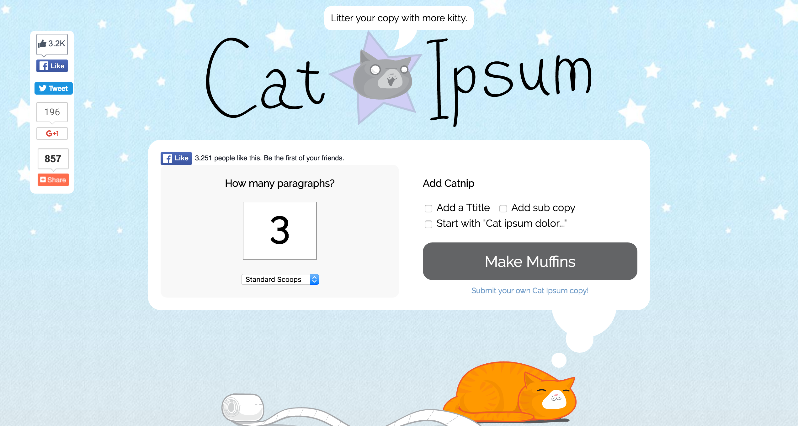
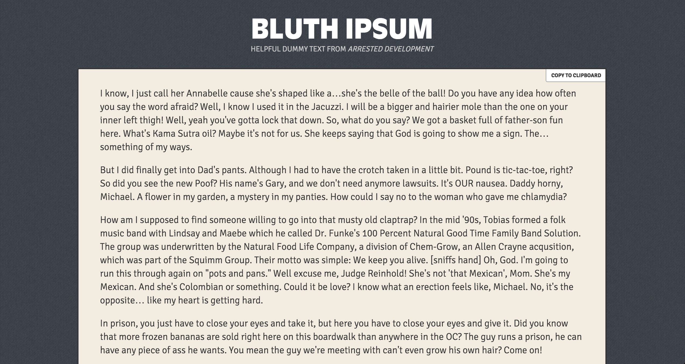
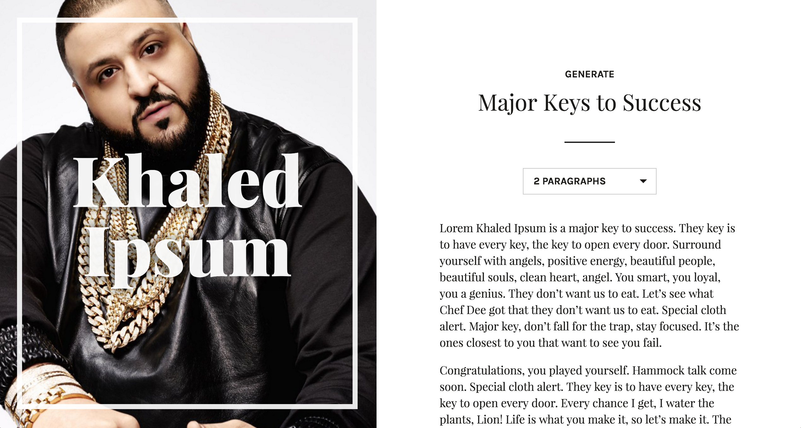
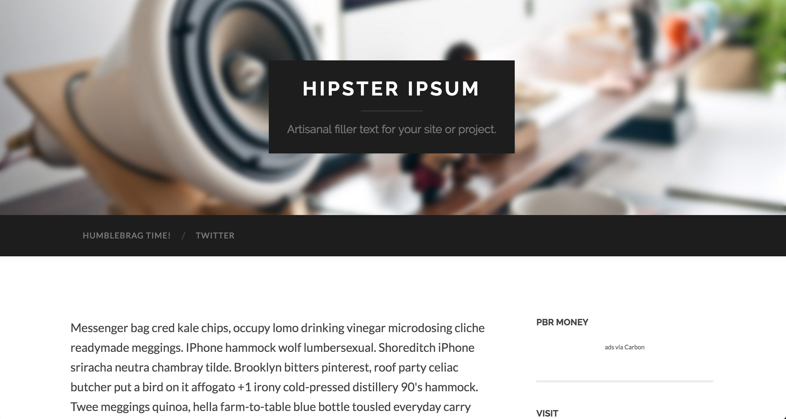
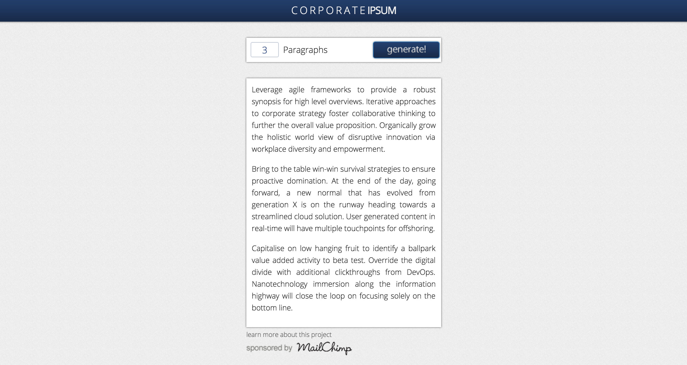
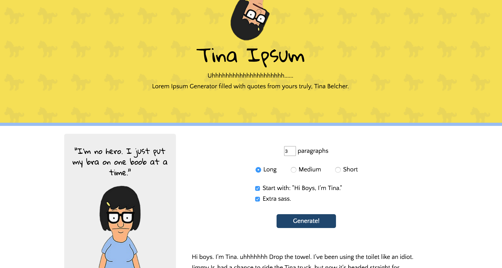
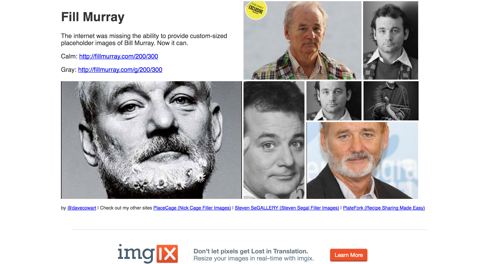
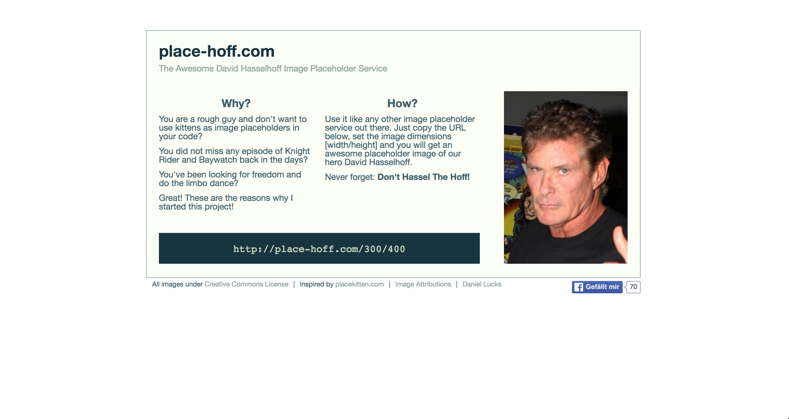
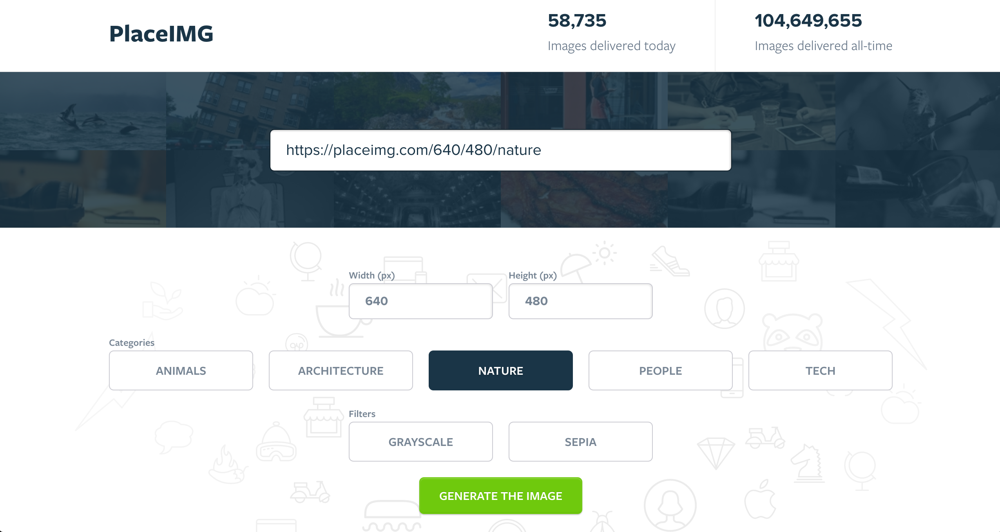

<em> As a designer & developer, I've spent the past 10+ years needing placeholders while I build designs. While photos of my cats and vanilla Lorem Ipsum do the job, they get stale. Cure the Flava! Here's a list of my favorite (and easy to use) text and image placeholder generators. </em>
 

<h2> Why use Placeholders? </h2>

 When building a site. Duh. But really, It's hard developing a site  when you have a strong vision for the design, yet lack <em>all</em> the content. 

 That's where placeholders come in! Back in the day one may have had to resort to plain ole Lorem Ipsum or gray boxes. Those days are behind us as the internet caught up with updating the drab tradition. Now there are [probably] thousands, if not bajillions, of options out there! No need to feel overwhelmed, I have chosen 13 top notch placeholder choices for all your text and image needs. Enjoy. 

 
<h2><mark>The Ipsums </mark></h2>

<h4> <strong> <a href="http://www.catipsum.com/" target="_blank"> Cat Ipsum </a> </strong></h4>
<figure>
  
  <figcaption> Let's kick this off with the obvious, cat ipsum.  </figcaption>
</figure>

<h4> <strong> <a href="http://loremdimsum.com/" target="_blank"> Lorem Dimsum  </a> </strong></h4>
<figure>
  
  <figcaption> Clever name and the greatest looking design. This one wins all the lorem awards. Not to mention, it makes me crave take-out. </figcaption>
</figure>

<h4> <strong> <a href="http://bluthipsum.com/" target="_blank"> Bluth Ipsum </a> </strong></h4>
<figure>
  
  <figcaption> If you've like got better things to do, like build shelters for misplaced pigeons, then this ipsum has you covered while you create prototypes for all your brilliant idea. </figcaption>
</figure>

<h4> <strong> <a href="http://kahlidipsum.com" target="_blank"> Kahlid Ipsum </a> </strong></h4>
<figure>
  
  <figcaption> This ipsum is key </figcaption>
</figure>

<h4> <strong> <a href="http://hipsum.co/" target="_blank"> Hipster Ipsum </a> </strong></h4>
<figure>
  
  <figcaption> If you've like got better things to do, like build shelters for misplaced pigeons, then this ipsum has you covered while you create prototypes for all your brilliant idea. </figcaption>
</figure>

<h4> <strong> <a href="http://www.cipsum.com/" target="_blank"> Corporate Ipsum </a> </strong></h4>
<figure>
  
  <figcaption> The evolution of this dynamic ipsum adds value and diversity to any strategically planned production application.  </figcaption>
</figure>

<h4> <strong> <a href="http://tinaipsum.rocks//" target="_blank"> Tina Ipsum </a> </strong></h4>
<figure>
  
  <figcaption> The evolution of this dynamic ipsum adds value and diversity to any strategically planned production application.  </figcaption>
</figure>

  

  

<h2><mark>The Images </mark></h2>

<h4> <strong> <a href="http://www.fillmurray.com/" target="_blank"> Fill Murray </a> </strong></h4>
<figure>
  
  <figcaption> Fill Murray: because Bill's always got your back. </figcaption>
</figure>

<h4> <strong> <a href="https://http://place-hoff.com/"> Place-Hoff </a></strong></h4>
<figure>
  
  <figcaption> For when you find it hard to replace a photo of Bill, turn to the Hoff instead. Gets the job done.</figcaption>
</figure>

<h4> <strong> <a href="https://www.placecage.com/"> Place Cage </a></strong></h4>
<figure>
  
  <figcaption> Ideal for when you need to get revenge against someone or you need motivation to wrangle up your own content.</figcaption>
</figure>

<h4> <strong> <a href="https://placeimg.com/"> PlaceIMG </a></strong></h4>
<figure>
  
  <figcaption> In case you're not in the market for older men, there's always the option to have your choosing of various categories, such as animals, architecture and nature. Bonus points for this site having a snazzier ux.</figcaption>
</figure>

<h4> <strong> <a href="https://placekitten.com/"> Place Kitten </a></strong></h4>
<figure>
  
  <figcaption> Then there's kittens. Because kittens(!). In case you need further reasoning to use a kitten to fill in, even the <a href="http://petapixel.com/2013/07/30/chicago-tribune-accidentally-publishes-a-cat-placeholder-photo-on-front-page/ " target="_blank"><u>Chicago Tribune</u> does it. </a></figcaption>
</figure>

<h4> <a href="http://www.http://lorempixel.com/.com/"> Lorempixel </a></h4>

 For when you need something a little more specific. Yeah, you're not always guranteed an artful still of America's  

