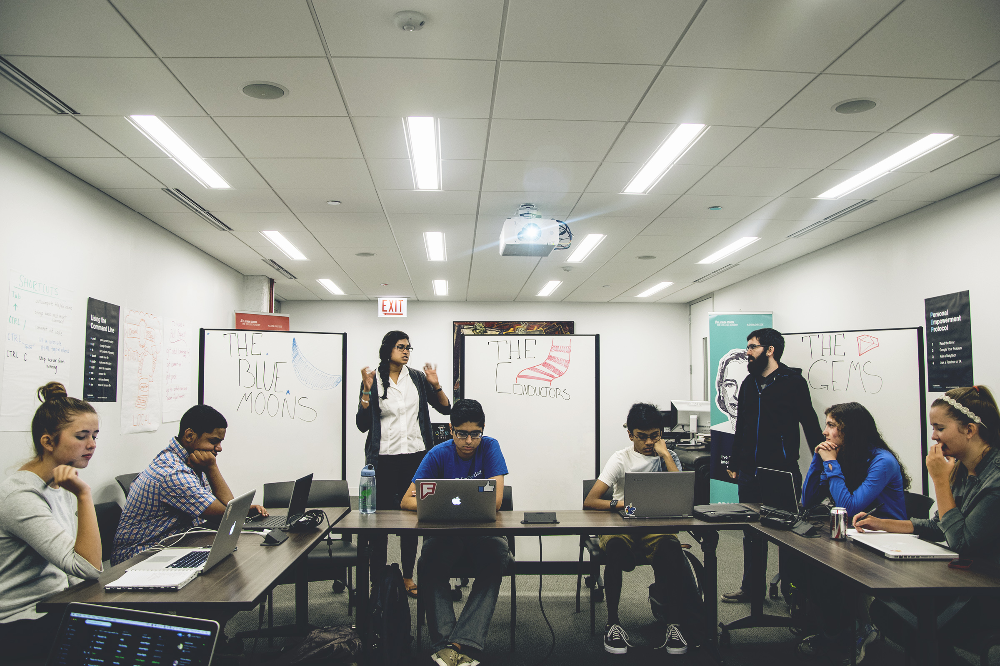

<em> brief description of post </em>

 

<h2> Title </h2>

 Paragraph  

 

<figure>
<<<<<<< HEAD
  

  
  <figcaption> Caption  </figcaption>
=======
  

  
  <figcaption> The advanced class revolved heavily around group projects.  </figcaption>
>>>>>>> origin
</figure>
  
