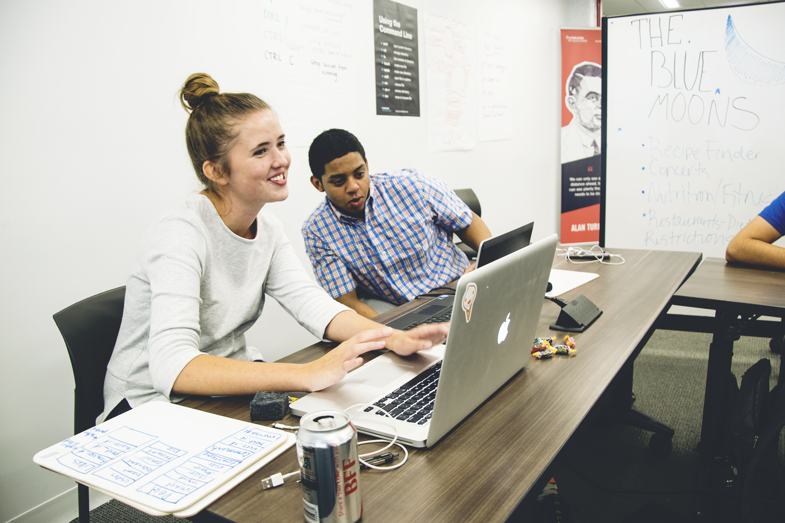

<em> With stay-at-home orders having no end in sight, I decided to use this time to focus on all the things I've been putting off because of lacking time. In order to hold myself accountable, I'm using daily blogs to track what I learned that day, no matter how small or basic it might be.</em>

 

<h2> TIL: April 27 </h2>

<h3>Codecademy: Computer Science Path</h3>

 Thanks to a very generous offer, I was granted access to a Codecademy Pro subscription for free. T  

 

<!--
<figure>
  

  
  <figcaption> Caption  </figcaption>
</figure>
   -->
